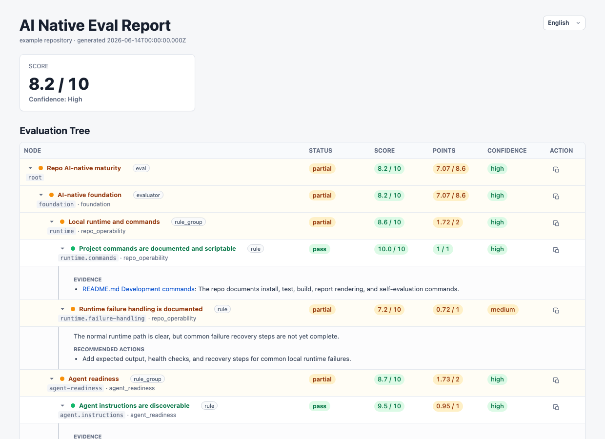

English | [中文](README_CN.md)

[](https://github.com/aiaccelerationism/ai-native-eval/actions/workflows/ci.yml)
[](LICENSE)
[](https://nodejs.org/)

**Make Repositories AI-Native** — An evidence-driven evaluation and repair system that helps AI agents understand, score, and improve your repository's development workflow until humans and agents can repeatedly ship reviewable, high-quality work together.

**Built for self-improving repos.** Get a deterministic `0.0 / 10` AI-native maturity score, see exactly why the repo is not `10 / 10`, and give agents the repair path they need to improve the repo run after run.

## Why ai-native-eval?

Traditional repo checks tell you whether code builds. `ai-native-eval` asks whether a human and AI agent can keep shipping high-quality work together.

- **AI-native score**: get a `0.0 / 10` maturity score for the repository.
- **Why not 10/10**: see exactly which evidence-backed deductions kept the repo from a perfect score.
- **Agent repair loop**: turn recommendations into tasks an agent can execute.
- **Lifecycle coverage**: evaluate docs, agent instructions, issues, PRs, CI, tests, runtime commands, review artifacts, and historical evidence.
- **Targeted lifecycle checks**: route issue, PR, thread, turn, periodic, or project-specific evaluation contexts without always running a full repository review.
- **Deterministic aggregation**: final scores are computed from evaluator rubrics.
- **Pluggable evaluators**: add built-in, BMAD, or project-specific evaluator packs.

## Quick Start

Copy this prompt to your agent:

```text
Evaluate my repository with ai-native-eval from https://github.com/aiaccelerationism/ai-native-eval.
```

## Report Preview



```text
Score: 8.2 / 10
AI-native foundation: 8.2 / 10
  Local runtime and commands: 8.6 / 10
  Agent readiness: 8.7 / 10
  GitHub workflow: 7.8 / 10
  Evidence and artifact discipline: 7.6 / 10
    Why not 10/10:
      - Runtime failure recovery steps are not complete.
      - Evaluator findings are not always converted into tracked follow-up work.
      - Report screenshots or traces are not consistently linked from PR evidence.
```

The report gives humans and agents the same review surface:

- A `0.0 / 10` AI-native maturity score for the repository.
- A nested evaluator tree covering docs, agent readiness, GitHub workflow, CI/tests, local runtime, evidence quality, architecture, BMAD adoption, and optional evaluator packs.
- Evidence-backed "Why not 10/10" deductions.
- Recommendations that can become agent repair tasks.
- Static HTML and compact Markdown output.
- Source-controlled config for enabling, disabling, reweighting, or adding evaluator packs.
- Incremental evaluations that can reuse prior evidence instead of starting from zero every time.
- Trigger metadata for one-shot, turn-inline, self-iteration, periodic, or external-event integrations, while external systems remain responsible for hooks, schedulers, comments, and repair loops.
- ESLint-style policy rules with `off`, `warn`, and `error` severities, so reports can show blocked/error conditions without changing the numeric score.

## Built-In Evaluator Packs

`ai-native-eval` ships with lifecycle entry packs plus reusable evaluator packs for repo foundation and BMAD Method adoption.

| Pack | Purpose |
| --- | --- |
| `ai-native-repo-maturity-evaluator` | Full repository baseline and incremental repository-level review. |
| `ai-native-pr-lifecycle-evaluator` | Pull request opened, review, pre-merge, post-merge, and closeout evaluation. |
| `ai-native-issue-lifecycle-evaluator` | Issue intake, planning, follow-up, and handoff evaluation. |
| `ai-native-thread-checkpoint-evaluator` | Agent thread checkpoint, handoff, collaboration trace, and closeout evaluation. |
| `ai-native-turn-guardrail-evaluator` | Single user turn or agent response guardrail evaluation. |
| `ai-native-periodic-health-evaluator` | Scheduled or ad hoc repository health and drift evaluation. |
| `ai-native-foundation-evaluator` | General AI-native repo foundation: operability, docs, agent readiness, GitHub workflow, CI/test gates, product UX evidence, architecture, and evidence discipline. |
| `bmad-method-evaluator` | BMAD Method adoption and artifact maturity. |

A repo can use the built-in packs, add project-specific evaluator packs, or disable evaluator areas that are not relevant to its workflow.

## How It Works

The eval flow is designed to be repeatable and auditable.

1. Resolve scope, repo root, current commit, and available evidence.
2. Determine the evaluation context: full baseline, incremental run, issue/PR event, thread checkpoint, user turn, periodic scan, or project-specific lifecycle.
3. Read previous eval state if present.
4. Resolve effective config from the selected lifecycle root, optional user config, project config, explicit run overrides, and evaluator-specific config under `evaluators[pluginId]`.
5. Write a run folder with `run.json` as the audit snapshot.
6. Resolve installed evaluator plugins through direct child references.
7. Group evaluators into execution batches when useful.
8. Write each enabled leaf evaluator's judgment to its own JSON file.
9. Validate the folder against the run snapshot, installed manifests, and leaf rubrics.
10. Aggregate normalized evaluator nodes deterministically.
11. Render static HTML and optional Markdown/JSON artifacts.

Validation catches inconsistent evaluator outputs before rendering, so broken or incomplete runs do not quietly become polished reports.

## Scoring

Scores are computed from evaluator rubrics.

- Leaf evaluators output judgments against checklist-style deduction groups.
- AI selects applicable deductions and supplies reasons/evidence.
- The bundled TypeScript tool retrieves the rubric from the evaluator skill and calculates points deterministically.
- A deduction group `budget` caps same-group penalties to avoid duplicate over-deduction.
- Deduction groups must be able to deduct their full budget.
- If a leaf is not `10.0 / 10`, it must explain why through applied deductions.
- Parent scores are weighted averages of applicable child scores.
- Confidence is separate from score and reflects evidence coverage.

High scores require repeated evidence across docs, issues/PRs, CI/tests, artifacts, and workflow history. Polished docs alone should not create a high-confidence `10 / 10`.

## Reports

The bundled TypeScript renderer produces a drill-down HTML report from the same evaluation tree used for scoring. The report includes nested node results, evidence links, recommendations, improvement references, copyable repair prompts, and reproducibility metadata.

## Configuration And Persistence

Repos being evaluated may store eval state under:

```text
.ai-native-eval/
  config.json
  state.json
  evidence-ledger.jsonl
  artifacts/
    20260614T183012Z-a1b2c3d4e5f6/
      run/
        run.json
        evaluators/
      report.html
      report.md
      report.json
      snapshot.json
      manifest.json
```

`config.json`, `state.json`, and small evidence ledgers may be source-controlled when they define shared project policy or durable evaluation state. A normal evaluation writes a timestamped generated bundle under `artifacts/` by default, so the complete run can be copied, attached, reviewed, or removed as one directory. Generated output under `artifacts/` is ignored by default. Promote reviewed reports into a stable committed evidence folder when they should become part of the repo history.

## Repo Layout

```text
ai-native-eval/
  .agents/
    skills/
      ai-native-eval/
        SKILL.md
        agents/openai.yaml
        scripts/
          eval/
            package.json
            pnpm-lock.yaml
            tsconfig.json
            src/
            fixtures/
            tests/
      ai-native-foundation-evaluator/
      ai-native-repo-maturity-evaluator/
      ai-native-pr-lifecycle-evaluator/
      ai-native-issue-lifecycle-evaluator/
      ai-native-thread-checkpoint-evaluator/
      ai-native-turn-guardrail-evaluator/
      ai-native-periodic-health-evaluator/
      bmad-method-evaluator/
      _eval-support/
        bin/codex
        grade-response.mjs
  tools/
    skill-eval.sh
  tests/
    skill-packaging.test.mjs
  package.json
```

The report renderer and deterministic aggregation source live in the `ai-native-eval` skill bundle at `.agents/skills/ai-native-eval/scripts/eval/`. See [docs/architecture.md](docs/architecture.md) for evaluator boundaries and plugin resolution details.

## Foundation Self-Evaluation

This repo evaluates itself and publishes a strict baseline report.

- Score: `3.4 / 10`
- Level: `3`
- Confidence: `high`
- Scope: foundation maturity plus AI Native Eval evaluator-system quality and research readiness; `bmad-method-evaluator` is disabled for this self-evaluation.
- AI participation: foundation scoring now reserves 40% for AI participation, including agent threads, source control AI participation, skill activation, AI self-assessment, human follow-through, and collaboration trace.
- Research readiness: the repo now has a research plan, pilot protocol, and metrics/data schema; strict deductions remain for missing pilot execution and recent-change follow-through.
- Recent-change evidence: strict deductions apply because the baseline does not yet link each evaluator to proof from the latest five PR-equivalent substantive changes.
- Run folder: `self-evaluations/foundation-20260614/run/`
- Compact report: [self-evaluations/foundation-20260614/report.md](self-evaluations/foundation-20260614/report.md)

The baseline is generated from per-leaf evaluator JSON files and can be regenerated with:

```sh
pnpm self-eval:validate
pnpm self-eval:render
```

## Research Plan

This repo also tracks a research plan for testing whether eval-guided AI-native adoption improves measurable development outcomes beyond informal AI-native intent.

- Research plan: [docs/research-plan.md](docs/research-plan.md)
- Pilot protocol: [docs/research-pilot-protocol.md](docs/research-pilot-protocol.md)
- Metrics and data schema: [docs/research-data-schema.md](docs/research-data-schema.md)

## Skill Evaluations

Each skill owns its eval cases next to its `SKILL.md`:

```text
.agents/skills/<skill>/evals/
  eval.yaml
  expectations/
  solutions/
```

```sh
pnpm skill-eval:contract
pnpm skill-eval:live
pnpm skill-eval:skill contract ai-native-eval
pnpm skill-eval:skill live ai-native-eval
```

Contract evals validate skill fixtures. Live evals run the real Codex path and are kept separate from the default deterministic test suite.
`contract` mode does not invoke a real agent. `live` mode intentionally invokes the real Codex CLI and may be slower or less deterministic.

## Development Commands

Useful commands for developing this repository:

```sh
pnpm test
pnpm render:example
pnpm score:example
pnpm persist:example
pnpm self-eval:validate
pnpm self-eval:render
pnpm test:human
```

## Contributing

Contributions are welcome. See [CONTRIBUTING.md](CONTRIBUTING.md) for the development flow, evaluator-change expectations, and pull request checklist.

## Security

Please report vulnerabilities privately. See [SECURITY.md](SECURITY.md) for reporting guidance and eval artifact safety notes.

## License

MIT License. See [LICENSE](LICENSE) for details.
